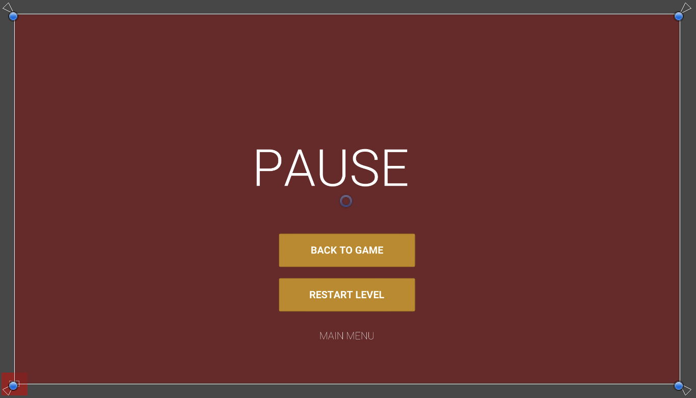
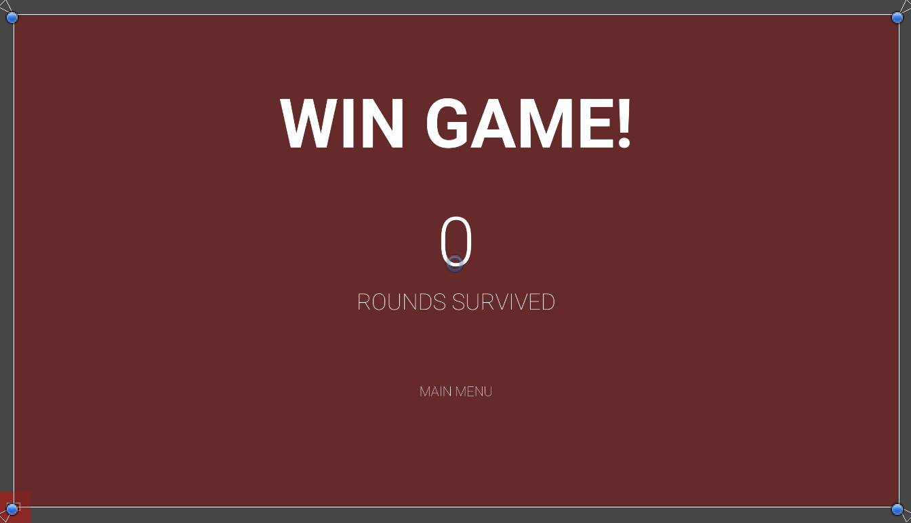
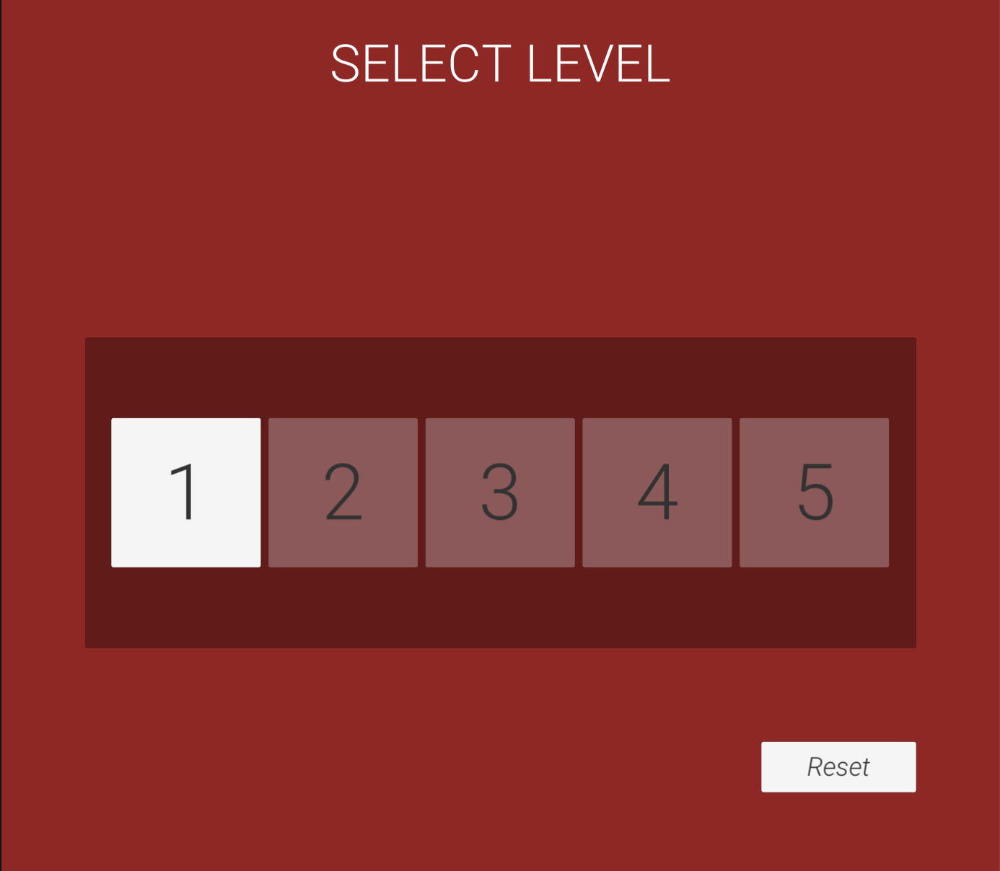

# GameHolics

A student group at USC, aiming at the next generation tower defense game.

## Integrations

###### edited by Ruoxw Feb 23

### System Integration

#### Folder Structure

- Animations
  - UI: for all the animations related to UI (e.g. Button.controller)
  - Enemy
  - etc.
- Font (hardly changing)
- Prefabs
  - UI: for all prefabs related to UI (e.g. LevelButton.prefab)
  - Enemy
  - Tower
  - etc.
- Scenes (hardly changing)
- Scripts
  - Game Manager: for all scripts related to game mechanism management (e.g. GameStatus.cs)
  - UI: for all scripts related to UI Canvas, etc.
  - Enemy
  - Tower
  - etc.
- Sprites
  - Others: for game public components (e.g. HealthBar.png)
  - Enemy
  - Tower
  - Tiles: only for tilemap sprites
  - etc.
- Tilemap (only for tailmap palette)

When put new stuff into **Animations, Prefabs, Sprites, Scripts** folder, put them in the right folder or create a new folder.

### Github Integration

All changes push to **main** branch

But we can also create individual branches as workspaces.

We only need to push these listed ...stuff in our game project GitHub repository

- Assets
- Pakages
- ProjectSettings
- .gitignore
- README.md

##### Personal thought if it helps...

Now we have a new version of .gitignore, so we can either 

1. Totally delete the old individual branch *(I tried force pull, force push, rest etc., but didn'y work well... Delete both remote and local individual branch and create a new one(with a different name - important) works for me)*

Or

2. Clean untracked files by command

   ` git rm --cached <file_name>`

   ...and then push to the old individual branch.

Good Luck!

## Dev Log

### Week 6 Progress

#### Donghao

1. Created animations for two enemies
2. Add functions for these two enemies

#### Ruoxuan

1. System Integration readme
2. Level select and unlock

#### Sheng

Implemented start menu with volume control

#### Shuqi

1. Implemented choosing and placing tower
2. Game audio integration

---

### Week 7 Progress

Gameplay group(Donghao, Ruoxuan, Shuqi)

Completed: 

- Fixed enemy animation bug
- Fixed spawner bug
- Connect scene by SceneFader component

- Menus (all functions work)

  1. Pause Menu(Press Space to trigger)
     - Back Button
     - Restart Button
     - Main Menu Button

  2. Win Level Menu
     - display rounds survived
     - Next Level Button
     - Main Menu Button

  3. Win Game Menu
     - display rounds survived
     - Main Menu Button

  4. Level Selector Menu
     - Level selector buttons: pass current level to unlock the next level
     - Reset Button: reset game progress; only level 1 is unlocked

